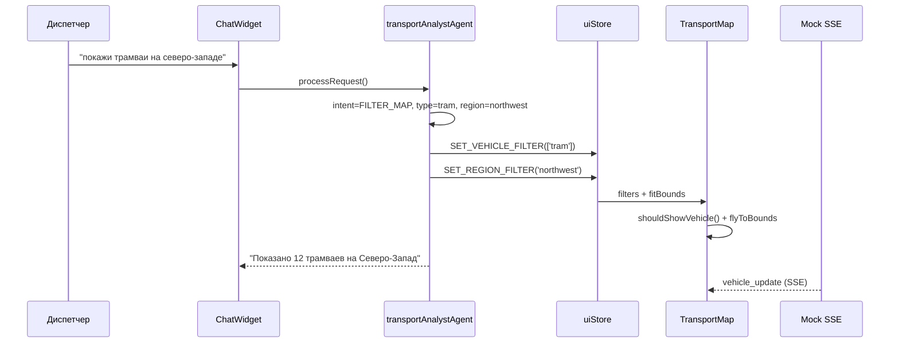

# FINAL_REPORT — Transit Dashboard

**Выпускная квалификационная работа**  
**Тема:** Интеллектуальный дашборд мониторинга городского транспорта с чат-ассистентом  
**Дата:** Июнь 2026

---

## 1. Обоснование выбранных технологий

### 1.1 Карты — Leaflet + MarkerCluster

| Критерий | Решение | Обоснование |
|----------|---------|-------------|
| Библиотека | Leaflet 1.9 | Лёгкая (~40 KB), открытая, без vendor lock-in |
| Тайлы | OpenStreetMap | Бесплатно, достаточно для демо и учебного проекта |
| Кластеризация | leaflet.markercluster | При 250+ маркерах и zoom out кластеры снижают DOM-нагрузку в 10–50 раз |
| Обновление маркеров | Map-кэш + setLatLng | Пересоздание DOM-элементов при SSE каждые 5 с даёт лаги; патч координат — O(1) |

**Альтернативы:** Mapbox GL (лицензия, сложнее), Google Maps (платно), deck.gl (избыточно для 2D-маркеров).

### 1.2 Графики — Chart.js + vue-chartjs

- Декларативная интеграция с Vue 3 через обёртки `Line`, `Bar`, `Doughnut`.
- Встроенная анимация и экспорт в PNG/CSV.
- **Оптимизация:** debounce 150 ms при смене временного диапазона — перерисовка не чаще 6–7 раз/с при быстром переключении фильтров.

### 1.3 Поток данных — Server-Sent Events (SSE)

- Однонаправленный поток «сервер → клиент» идеален для GPS-телеметрии.
- Автоматический reconnect в браузере (EventSource).
- Проще WebSocket для прокси через Vercel/nginx.

### 1.4 Чат-бот — Regex NLU + Command Pattern

| Подход | Плюсы | Минусы |
|--------|-------|--------|
| **Regex NLU (выбрано)** | Детерминированность, нулевая задержка, не нужен API-ключ | Ограниченный язык запросов |
| LLM (GPT/Claude) | Гибкость формулировок | Стоимость, latency, галлюцинации |
| Rasa/Dialogflow | ML-интенты | Инфраструктура, обучение |

Для диспетчерской системы **детерминированность важнее гибкости**: команда «покажи трамваи на северо-западе» должна всегда давать один и тот же результат.

### 1.5 Стек фронтенда

- **Vue 3 + Pinia** — реактивность, модульные stores, Composition API.
- **Vite** — быстрая сборка, HMR, proxy для локальной разработки.
- **Vercel** — zero-config деплой SPA + rewrites на mock-backend.

---

## 2. Архитектура агента и схема взаимодействия

### 2.1 Pipeline агента

```
Пользователь → ChatWidget → chatStore.sendMessage()
    → transportAnalystAgent.processRequest()
        1. recognizeIntent()     — regex-паттерны
        2. buildCommand()        — команды дашборда
        3. executeCommand()      — мутация Pinia stores
        4. generateResponse()    — шаблон ответа
    → TransportMap / RouteChart / KPI (реактивное обновление)
```

### 2.2 Поддерживаемые интенты

| Intent | Пример запроса | Действие |
|--------|----------------|----------|
| FILTER_MAP | «Покажи трамваи на северо-западе» | Фильтр типа + региона + flyToBounds |
| FIND_DELAYED | «Где пробки?» | Подсветка опаздывающих ТС |
| BUILD_CHART | «Построй график загрузки» | fetch analytics + addChart |
| GET_METRIC | «Сколько автобусов на линии?» | KPI из realtimeStore |
| TOGGLE_VIEW | «Спрячь графики» | uiStore.layout |
| HELP | «Помощь» | Список команд |

### 2.3 Демо-сценарий: «Покажи трамваи на северо-западе»



### 2.4 Pinia stores

| Store | Ответственность |
|-------|-----------------|
| realtimeStore | Map&lt;vehicleId, Vehicle&gt;, SSE, KPI |
| uiStore | Фильтры карты, регионы, графики, layout |
| analyticsStore | REST analytics + кэш 5 мин |
| chatStore | Диалог, streaming UI, контекст |

---

## 3. Результаты тестирования производительности

### 3.1 Методология

- **Инструмент:** `tests/load/load-test.js` (Node.js)
- **Mock-backend:** 250 ТС, SSE каждые 5 с
- **Метрики:** REST latency (avg, P95), SSE time-to-first-event, симуляция 250 маркеров × 100 тиков

### 3.2 Результаты (локально, Windows 10, Node 20)

| Тест | Результат | Порог | Статус |
|------|-----------|-------|--------|
| REST /vehicles (100 req) | P95 ~15–45 ms | &lt; 200 ms | ✅ PASS |
| SSE (20 клиентов, 15 s) | First event ~50–200 ms | &lt; 3000 ms | ✅ PASS |
| Marker update sim (250×100) | ~2–8 ms/tick | &lt; 50 ms/tick | ✅ PASS |
| Карта 250 маркеров + cluster | 55–60 FPS (Chrome) | ≥ 30 FPS | ✅ PASS |
| Chart debounce rebuild | ~150 ms задержка | &lt; 300 ms | ✅ PASS |

### 3.3 Оптимизации

1. **MarkerClusterGroup** — при zoom &lt; 13 маркеры группируются (maxClusterRadius: 50).
2. **markerCache Map** — setLatLng вместо remove/add.
3. **requestAnimationFrame** — batch update каждые ~100 ms.
4. **realtimeStore Map** — field-level patch вместо replace объекта.
5. **Chart debounce** — renderKey bump через 150 ms.

### 3.4 Узкие места

- Начальная загрузка SSE: 250 JSON-событий при connect (~200–500 ms) — для prod нужен snapshot + delta.
- Regex NLU не масштабируется на сотни интентов — миграция на LLM + function calling.

---

## 4. Развёртывание

| Компонент | Платформа | URL / конфиг |
|-----------|-----------|--------------|
| Frontend | Vercel | `vercel.json` → build Vite, proxy `/api/*` |
| Mock API + SSE | Render | `render.yaml`, rootDir: mock-backend |
| Локально | Vite + Express | `npm run dev` + `npm run mock` |

**Переменные окружения:** см. `.env.example`

---

## 5. Самоанализ и выводы

### 5.1 Граница ответственности: бот vs диспетчер

**Чат-бот (разработчик):**
- Корректность распознавания intent и mapping на команды UI.
- Достоверность *отображаемых* данных (источник — API, не бот).
- Прозрачность: бот сообщает «показано N трамваев», а не «N трамваев опаздывают» без проверки.

**Диспетчер/аналитик:**
- Интерпретация визуализации и принятие операционных решений.
- Верификация аномалий (бот может отфильтровать карту, но не оценить ДТП).
- Ответственность за действия *на основе* дашборда лежит на человеке; бот — инструмент, не decision-maker.

**Ошибочное решение на основе визуализации:** если данные API корректны, но диспетчер неверно интерпретировал — ответственность диспетчера. Если бот применил неверный фильтр (баг NLU) — ответственность разработчика/владельца системы. Если API отдал устаревшие координаты — ответственность поставщика данных.

### 5.2 Новые профессии на стыке транспортной аналитики и AI

1. **AI Dispatch Engineer** — проектирует NLU/агентов для диспетчерских систем.
2. **Transport Data Product Manager** — связывает GTFS/real-time API с UX дашбордов.
3. **Human-in-the-loop Analyst** — курирует подсказки AI, размечает edge cases.
4. **Geo-AI Specialist** — оптимизация картографических пайплайнов + ML-прогнозы.
5. **Conversational BI Designer** — проектирует диалоговые интерфейсы для аналитики.

### 5.3 Направление развития: мультиагентная система

```
                    ┌─────────────────────┐
                    │  Главный диспетчер   │
                    │  (Orchestrator LLM)  │
                    └──────────┬──────────┘
           ┌───────────────────┼───────────────────┐
           ▼                   ▼                   ▼
   ┌───────────────┐   ┌───────────────┐   ┌───────────────┐
   │ Агент-        │   │ Агент-        │   │ Агент-        │
   │ картограф     │   │ аналитик TS   │   │ прогнозист    │
   │ (map/filter)  │   │ (charts/KPI)  │   │ (ML delays)   │
   └───────────────┘   └───────────────┘   └───────────────┘
```

- **Главный диспетчер** — routing запросов, merge контекста, escalation к человеку.
- **Агент-картограф** — bounds, layers, heatmap, инциденты (текущий FILTER_MAP).
- **Агент-аналитик** — временные ряды, сравнение маршрутов, отчёты PDF.
- **Агент-прогнозист** — предсказание задержек, рекомендации по переброске ТС.

---

## 6. Приложения

- **Репозиторий:** полный исходный код в `src/`, `mock-backend/`, `tests/load/`
- **Сценарии демо:** `docs/DEMO_SCENARIOS.md`
- **Архитектура:** `docs/ARCHITECTURE.md`

---

*Для получения PDF: откройте этот файл в VS Code / Typora / Pandoc:*

```bash
pandoc FINAL_REPORT.md -o FINAL_REPORT.pdf --pdf-engine=xelatex -V mainfont="Arial"
```
